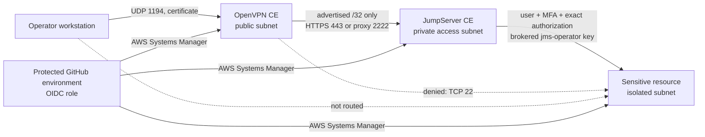

# AWS PAM access showcase

This repository demonstrates a deliberately narrow privileged-access path to one isolated AWS resource. OpenVPN Community Edition grants network reachability to one private JumpServer endpoint; JumpServer Community Edition then supplies identity, MFA, asset/account authorization, credential brokering, command filtering, and session audit. VPN membership alone never authorizes direct SSH to the target.

> This is a cost-conscious, single-node security demonstration. It is not a production-ready JumpServer architecture. Nothing deploys on push or pull request.

## Security architecture



The target and JumpServer have no public IP. The isolated subnet has no Internet or NAT default route. The target security group accepts TCP 22 only from the JumpServer security group; it does not accept the VPN client CIDR or the OpenVPN instance. OpenVPN pushes only `10.42.10.10/32` and its host firewall explicitly rejects forwarding to `10.42.20.0/24`.

## Ownership boundaries

| Terraform owns | Ansible owns |
| --- | --- |
| VPC, three subnet classes, routes, NAT/IGW/EIPs, endpoints | OS hardening, packages, host firewalls |
| Security groups, EC2, encrypted EBS, instance profiles | OpenVPN configuration and PKI installation |
| OIDC roles, KMS keys, empty secret containers | JumpServer install, TLS, services, API policy |
| SSM transfer bucket, log groups, budget | Restricted target user, SSH key use, status file |

Terraform has no provisioners and never generates secret values. Ansible reaches every instance with `amazon.aws.aws_ssm`; EC2 port 22 is never an administrative path.

## Demonstrated and denied paths

- Allowed: operator CIDR → OpenVPN UDP 1194.
- Allowed after VPN authentication: VPN client CIDR → JumpServer HTTPS 443 and SSH proxy 2222.
- Allowed after JumpServer authentication and authorization: JumpServer security group → target TCP 22 as `jms-operator`.
- Denied: Internet → JumpServer; VPN client → target; OpenVPN host → target; any EC2 key-pair login.
- Denied by policy: `sudo -i`, `sudo su`, `sudo su -`, and `cat /etc/shadow` for the one demonstration user/account/asset tuple.

## Repository map

```text
bootstrap/                         state bucket, state KMS key, environment-scoped OIDC roles
terraform/environments/showcase/  protected main infrastructure root and native tests
terraform/modules/                network, SSM, secrets, compute, observability
ansible/roles/                     common, openvpn, jumpserver, sensitive_resource, API bootstrap
scripts/                           secret creation, inventory, verification, evidence, cleanup
tests/                             unit, structure, and security policy tests
docs/                              architecture, operations, proof, risk, and limitations
.github/workflows/                 CI, plan, protected deploy, protected destroy
```

## Local prerequisites

- Terraform `1.15.8`, Python `3.12`, AWS CLI v2, `aws-vault`, GNU Make, OpenSSH, OpenSSL.
- The pinned validation tools in `versions.env`; `scripts/install_ci_tools.sh` installs their verified Linux binaries.
- Ansible collections from `ansible/requirements.yml`.
- An AWS identity permitted to run only the bootstrap stack for first setup.

## Bootstrap

Create `bootstrap/terraform.tfvars` with a unique `name_suffix` and the exact GitHub owner/repository. Then run:

```bash
aws-vault exec <profile> -- make bootstrap-init
aws-vault exec <profile> -- make bootstrap-plan TF_VARS='-var-file=terraform.tfvars'
aws-vault exec <profile> -- make bootstrap-apply TF_VARS='-var-file=terraform.tfvars'
```

Copy the outputs into the GitHub environments and variables described in [docs/bootstrap.md](docs/bootstrap.md). Bootstrap state is initially local because a stack cannot safely create its own backend. Protect or migrate that one local bootstrap state as an operator-controlled follow-up.

## CI, plan, deployment, and proof

`make ci` is credential-free and runs Terraform format/validate/tests, TFLint, Trivy, Ansible syntax/lint, yamllint, ShellCheck, actionlint, zizmor, Python lint/type/tests, Gitleaks, Markdown lint, and repository policy tests.

Pull requests also run the OIDC plan workflow in `showcase-plan`. It writes only resource addresses and actions to the job summary, uploads no raw plan, and blocks deletion or replacement.

Deployment is manual through `deploy.yml`, the protected `showcase-apply` environment, an exact commit on `main`, and confirmation `APPLY`. It applies a fresh plan, waits for SSM, creates absent secret versions, configures through SSM, proves a zero-change second Ansible run and Terraform plan, verifies controls, and uploads only sanitized evidence.

The human proof is intentionally separate: retrieve the VPN profile, install the private CA, connect to JumpServer, enroll MFA, open the one asset, show the allowed status file, demonstrate a denied command, and inspect the audit/session record. Follow [docs/demo-runbook.md](docs/demo-runbook.md).

## Evidence

The protected deployment produces:

```text
evidence/aws-controls.json
evidence/network-paths.json
evidence/jumpserver-policy.json
evidence/ansible-idempotence.json
evidence/terraform-idempotence.json
evidence/summary.md
```

Evidence contains no passwords, tokens, private keys, VPN profiles, Terraform state, or raw session recordings. Static tests prove implementation intent; only a successful protected deployment and manual runbook provide live operational proof.

## Destroy and cost warning

Use only the protected `destroy.yml` workflow with the exact deployment identifier and confirmation `DESTROY`. It captures sanitized inventory, revokes the VPN client, schedules generated secrets and KMS keys for deletion through Terraform, preserves the bootstrap backend, and fails if chargeable tagged resources remain.

In `us-east-1`, the default shape is approximately **USD 0.30/hour** or **USD 220/month** if left running continuously, before NAT/endpoint data, logs, and taxes. Destroy it after the demonstration. See [docs/cost-model.md](docs/cost-model.md).

## Production limitations

The deployment is one-AZ, single-node, and ephemeral. Production adoption requires highly available JumpServer components, external PostgreSQL and Redis, durable/tamper-resistant recording storage, backup and restore testing, enterprise identity/MFA integration, certificate lifecycle automation, centralized monitoring, formal ownership/on-call processes, and a reviewed disaster-recovery design. See [docs/limitations.md](docs/limitations.md).
